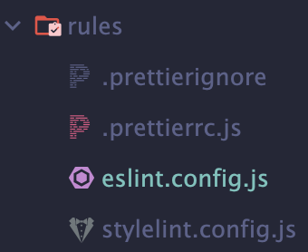
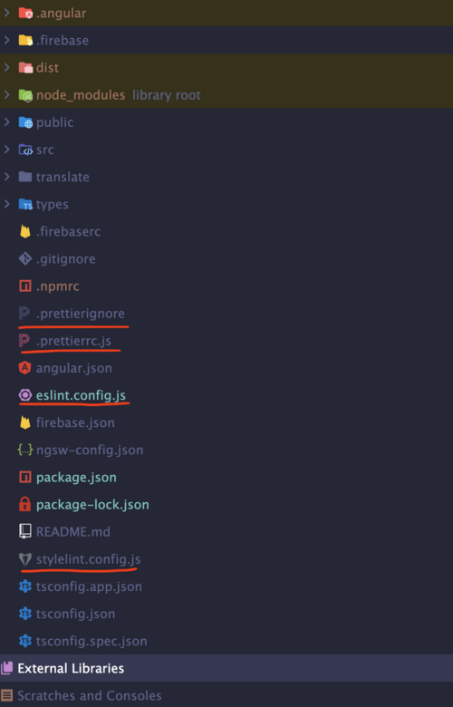

# @ngmd/linter

## Getting started

Библиотека для линтинга проектов @ngmd/\*

### Установка (от версии @0.0.1 и выше)

```sh
npm i -D @ngmd/linter
yarn add -D @ngmd/linter
```

### Подключение

- Копируем все файлы из папки <span style="color:#ed5a2b; font-size:16px;">rules</span>:

  

- Вставляем все скопированные файлы в корень рабочей директории:

  

- В файле <span style="color:#ed5a2b; font-size:16px;">tsconfig.json</span> устанавливаем правило **_strictNullChecks_** в значение **_false_**:

  ```json
    compilerOptions: {
      "strictNullChecks": false,
    }
  ```

- В файле <span style="color:#ed5a2b; font-size:16px;">angular.json</span> добавляем команду для линтинга:

  ```json
    "lint": {
      "builder": "@angular-eslint/builder:lint",
      "options": {
        "lintFilePatterns": ["<PATH>/**/*.html", "<PATH>/**/*.ts"]
      }
    }

  Заменить пути к проекту можно следующим образом:
      "lint": {
        "builder": "@angular-eslint/builder:lint",
        "options": {
          "lintFilePatterns": [
            "src/**/*.ts",
            "src/**/*.html"
          ]
        }
      }
  ```

### Переопределение правил для потребителя

- Для переопределения правил в eslint необходимо соблюдать следующую структуру в файле <span style="color:#ed5a2b; font-size:16px;">esling.config.js</span>:

```js
const {
  useAggregatorConfigs,
  expandLintIgnores,
} = require("@ngmd/linter/handlers");

const configOverrideSettings = {
  ignores: expandLintIgnores(["assets"]), // можно расширить дефолтный список игнорируемых файлов для линтера (просмотреть
  // список дефолтов можно в константе DEFAULT_LINT_IGNORES).
  // ignores: ['assets'], // или перезаписать уже существующие дефолты своими

  overrides: [
    {
      files: ["**/*.ts"], // расширение файлов, для которых предназначены перечисляемые ниже правила (это важно указывать,
      // потому что без указания этого массива линтер не поймет, какие ему нужны плагины для работы перечисляемых ниже
      // правил. Например, для добавления или переопределения правил '@angular-eslint/template'
      // необходимо указывать '**/*/html', и тогда линтер подхватит нужный ему плагин, который уже установился
      // вместе с установкой этой библиотеки (в данном случае
      // плагин 'template', который работает с html-шаблонами Ангуляра).

      rules: {
        // сами переопределямые правила:
        "@angular-eslint/component-selector": [
          "error",
          {
            type: "element",
            prefix: ["ng"],
            style: "kebab-case",
          },
        ],
        "@angular-eslint/directive-selector": [
          "error",
          {
            type: "attribute",
            prefix: ["ng"],
            style: "camelCase",
          },
        ],
      },
    },
  ],
};

module.exports = useAggregatorConfigs(configOverrideSettings);
```

<span style="color: red; font-size:24px;">ПЕРЕОПРЕДЕЛЯТЬ СУЩЕСТВУЮЩИЕ ПРАВИЛА ЛИНТЕРА КРАЙНЕ НЕ РЕКОМЕНДУЕТСЯ! ДЛЯ ЭТОГО ДОЛЖО БЫТЬ КАКОЕ-ТО ОБОСНОВАНИЕ, КОТОРОЕ СТОИТ ОБСУДИТЬ. ТО ЖЕ САМОЕ МОЖНО СКАЗАТЬ И ПРО ДОБАВЛЕНИЕ НОВЫХ ПРАВИЛ, ТК ЭТО ЧРЕВАТО ПОГРУЖЕНИЕМ В ТЕМУ РАБОТЫ ПО НАСТРОЙКЕ КОНФИГА И ВЫ НЕ ВСЕГДА СМОЖЕТЕ ОГРАНИЧИТЬСЯ ПРИВЕДЕННЫМ ПРИМЕРОМ ПО ОВЕРРАЙДУ ВЫШЕ, ТК ИМЕЕТСЯ РЯД ТОНКИХ НАСТРОЕК ПО РАБОТЕ ОПРЕДЕЛЕННЫХ ПРАВИЛ (PLUGINS, SETTINGS и тд)</span>
